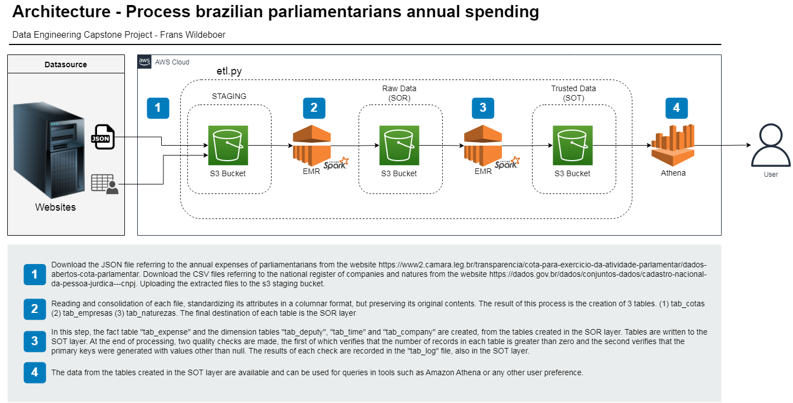
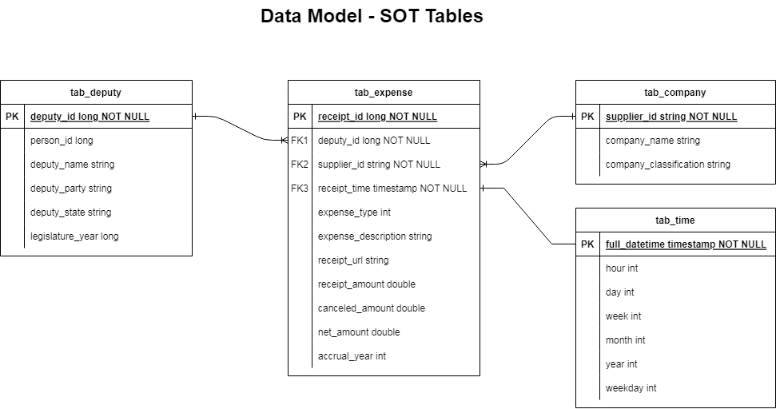

# Data Engineering Capstone Project - Frans Wildeboer
> The project's proposal is to solve a real big data problem. The solution involves the use of technologies for parallel processing, within a cloud computing environment, using Data Lakes infrastructure and data modeling for analytical purposes.  

## Table of Contents
* [General Info](#general-information)
* [Technologies Used](#technologies-used)
* [Features](#features)
* [Screenshots](#screenshots)
* [Setup](#setup)
* [Usage](#usage)
* [Project Status](#project-status)
* [Room for Improvement](#room-for-improvement)
* [Acknowledgements](#acknowledgements)
* [Contact](#contact)


## General Information

### Scoping the Project
The Brazilian government has made available open data on [_annual spending by its parliamentarians_](https://www2.camara.leg.br/transparencia/cota-para-exercicio-da-atividade-parlamentar/dados-abertos-cota-parlamentar). The files are available in several formats such as XML, JSON, CSV and XLSX. For the purposes of this project, the JSON format was chosen.

Some attributes of these files have low quality. For example, the name of the company where the expense occurred appears duplicated for the same company identifier. In this way, it was necessary to complement data from the [_national register of companies_](https://dados.gov.br/dados/conjuntos-dados/cadastro-nacional-da-pessoa-jurdica---cnpj), CSV files, to replace and add information on the spending files.

The raw files have been transformed and reorganized into new tables to help data analysts gain performance reading and analyzing this data.

### Steps taken
- Definition of the problem to be solved.
- Searching for files with the necessary data.
- Analysis of data quality.
- Data model creation.
- Definition of technologies to be used
- Construction of the data pipeline, with quality control.
- Tests.
- Writing documentation.
- Publication.

### Addressing Other Scenarios
- <u>What if the data was increased by 100x:</u> Perhaps the best solution for a short period is to autoscaling the EMR cluster, this way with more instances the final processing time would not be an issue, but perhaps the cost could be.
- <u>What if the pipelines would be run on a daily basis by 7 am every day:</u> Technology like Apache Airflow could be used for automatically orchestrate the pipeline and simplify execution and checking.
- <u>What if the database needed to be accessed by 100+ people: </u> When you open a database for reading, you don't need to put a read lock on it. This means that multiple users can read from the same database without impacting performance.

### Defending Decisions
- For IT resources the choice was for cloud computing instead of on premise computing. The reason is to be able to access as many resources as needed, almost instantly, and only pay for the use.
- For cloud computing services the choice was for the Amazon Web Services (AWS). It´s the major provider in cloud computing industry, more than 200 services and access can be mande via console or command line.
- For data storage the option was to create a Data Lake instead of a Data Warehouse. The reason is to have more flexibility to deal with unstructured data and enable the use of big data technologies like Apache Spark.
- For parallel processing the technology chosen was the Apache Spark. Because it´s easy to use, support lazy evaluation, has outstanding speed and performance, has lots of libreries and support multiple programing languages.
- For data modeling the choice was the star schema model, because it allows denormalized tables, making easier writing analytical queries with simple joins.
 

## Technologies Used
- Amazon CLI - version 2.0.30
- Amazon EMR - version 5.30
- Amazon EC2
- Amazon IAM
- Amazon VPC
- Amazon S3
- Apache Spark - version 2.4.5


## Features
- Process brazilian parliamentarians annual spending 


## Screenshots




## Setup
- Create an AWS account
- Create an IAM user
- Create a default VPC
- Set up credentials in EC2
- Create an S3 bucket to store log files produced by the cluster
- Install AWS CLI package awscli
- Set up AWS CLI environment (create the credentials and config files)
- Create an EMR cluster
- Allow SSH Access
- Create an SSH connection with the master node of the cluster
- Start using the EMR cluster
- Change the SOR and SOT destination path in etl.py file to your own buckets.
- Copy the credentials file (dl.cfg) and the executable file (etl.py) on the cluster terminal.  
- Submit the script on the cluster terminal.
`$spark-submit --master yarn ./etl.py`
[_Here_](https://towardsdatascience.com/how-to-create-and-run-an-emr-cluster-using-aws-cli-3a78977dc7f0) is a good tutorial on how to do most of the steps above. 

## Usage
- The data could be accessed in many ways because final tables are is stored is S3 plubic buckets. So the files could be downloaded or accesed by Amazon Athena or by Amazon EMR Notebook. An example below:

````
from pyspark.sql import SparkSession

spark = SparkSession.builder.getOrCreate()

tab_expense = spark.read.parquet('s3a://frans-udacity-studies/sot/tab_expense')
tab_expense.createOrReplaceTempView("tab_expense")

tab_deputy = spark.read.parquet('s3a://frans-udacity-studies/sot/tab_deputy')
tab_deputy.createOrReplaceTempView("tab_deputy")

query1 = spark.sql('''
                    SELECT b.deputy_name,
                           b.deputy_party,
                           cast(sum(a.net_amount) as decimal(13,2)) as net_amount
                    FROM tab_expense as a, 
                         tab_deputy  as b
                    WHERE a.deputy_id = b.deputy_id
                      AND accrual_year = 2017
                    GROUP BY b.deputy_name, b.deputy_party
                    ORDER BY net_amount desc
                    limit 1
                    ''' ).show(truncate=False)

# The Most Expensive Deputy in 2017
# +-----------+------------+----------+
# |deputy_name|deputy_party|net_amount|
# +-----------+------------+----------+
# |ROCHA      |PSDB        |577841.14 |
# +-----------+------------+----------+
````

## Project Status
Project is: _complete_ 


## Room for Improvement
- Automate the process through Apache Airflow


## Acknowledgements
- This project was inspired by an [_episode_](https://podcast.pizzadedados.com/e/episodio-005-serenata-de-amor/) of Pizza de Dados podcast.
- This project was based on the learning acquired in the [_Udacity Data Engineer Program_](https://www.udacity.com/course/data-engineer-nanodegree--nd027). 
- Many thanks to God, for being my dear Father, for loving me and giving me a new opportunity to be reborn in Jesus Christ. And to my wife Renata, for her love, dedication and especially for her patience, it wasn't easy to give up nights and weekends so I could study.


## Contact
Created by [@franswildeboer](https://www.linkedin.com/in/franswildeboer/) - feel free to contact me!
